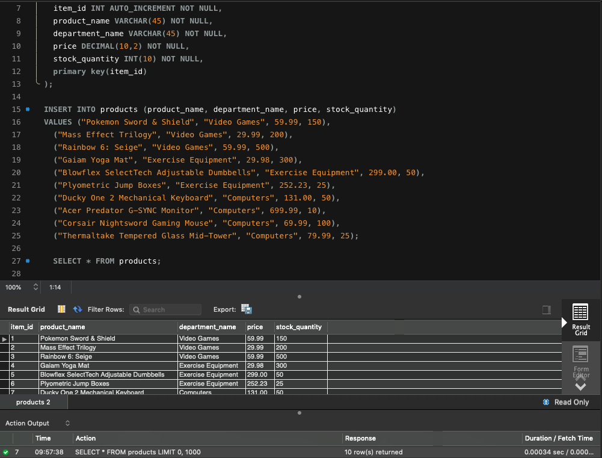
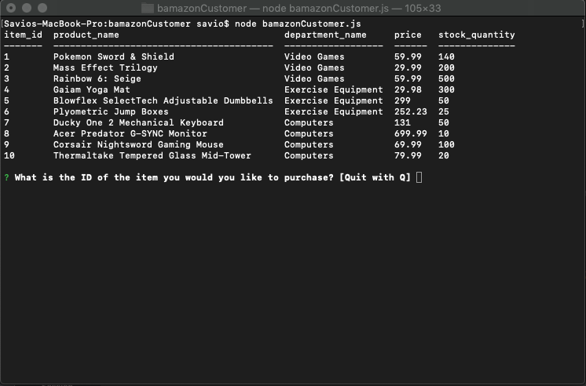
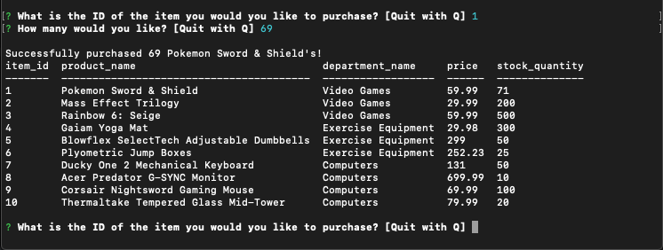
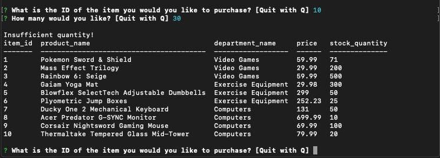

# MyBamazonSQL

Hello all,
For this homework, we were challenged to use our new found knowlegde of MySQL. The homework tested our knowledge of being able to use the terminal correctly and being able to use MySQLworkbench. This homework was actually really difficult but I was able to conquor it which got myself really hyped.

## MySQLWorkbench
- With this program I was able to create a database and create tables. The program feels a little outdated but I was able to manuver around it after getting use to it. It is pretty sraight forward. 

The image below will show you the work i did in MySQLWorkBench.

# Examples:
The screenshots below shows you how it works and that it's fully functional. 

